# 동행 - 시니어를 위한 AI 기반 쉽고 편한 뱅킹 키오스크

## 🥇 SSAFY 12기 특화 프로젝트 최우수상

> 개발, 출시 및 유지보수 기간 총 7주 (2025.02.24 ~ 2025.04.11)

# 🧾 프로젝트 소개

“동행”은 고령층의 디지털 금융 접근성을 향상시키고, 보이스 피싱 위험까지 예방할 수 있는  
고령층을 위한 AI 기반 쉽고 편한 **뱅킹 키오스크**입니다.

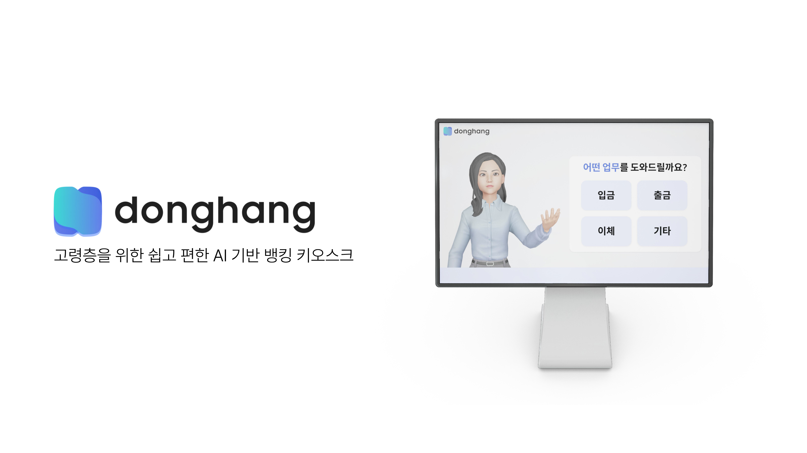

---

# 📚 목차

- 🎥 시연 영상
- 🖥️ 화면 구성
  - 🙋 일반 이용자
  - 🧓 시니어
- ⚙️ 기능 설명
- 🧱 인프라 구성
- 🛠️ 기술 스택
- 🗺️ 와이어프레임
- 📊 ERD
- 👥 팀원 소개

---

# 🎯 배경

- 고령화 사회가 가속화됨에 따라, 노인 인구의 디지털 격차 문제가 대두되고 있습니다.
- 은행을 포함한 공공 및 민간 서비스가 빠르게 디지털화되면서, 스마트폰이나 키오스크 사용에 익숙하지 않은 고령층은 정보 접근성과 금융 서비스 이용에서 소외되는 경우가 많습니다.
- AI 기반 무인 금융 환경의 확산에도 불구하고 고령층에게는 적합하지 않은 경우가 많습니다.

# ✨ 핵심 기능

1. 사용자 연령 인식 기반 UI 전환 (일반 사용자 / 고령층)
2. 3D AI 은행원을 통한 음성 기반 업무 처리
3. 보이스피싱 위험 감지 기능
4. 사용자 맞춤 상품 추천 

---

# 🎥 시연 영상

---

# 🖥️ 화면 구성

## 🙋 일반 이용자

### 1. 입금  

### 2. 출금  

### 3. 이체  

### 4. 거래 내역 조회  

### 5. 상품 가입  

## 🧓 시니어

### 1. 입금  
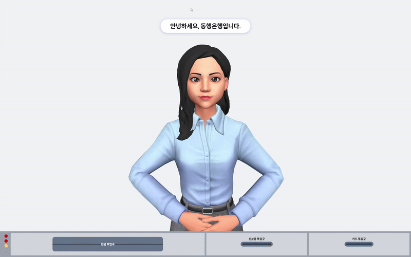

### 2. 이체  

### 3. 상품 가입  

### 4. 시니어 상호작용 컴포넌트  
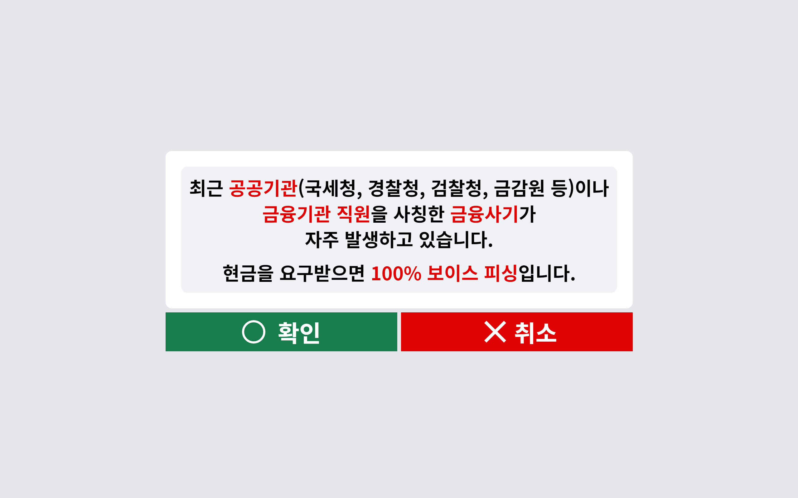
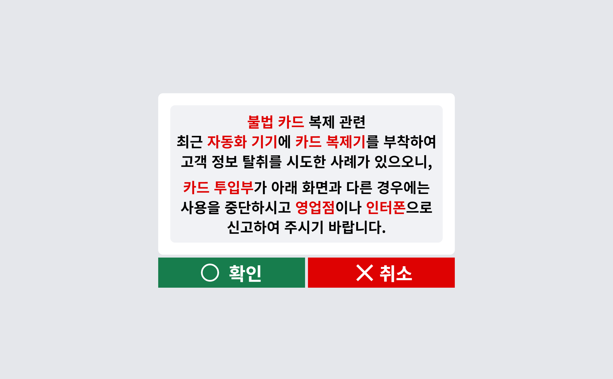
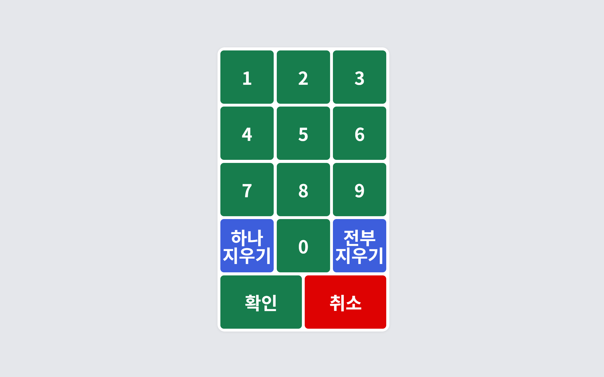
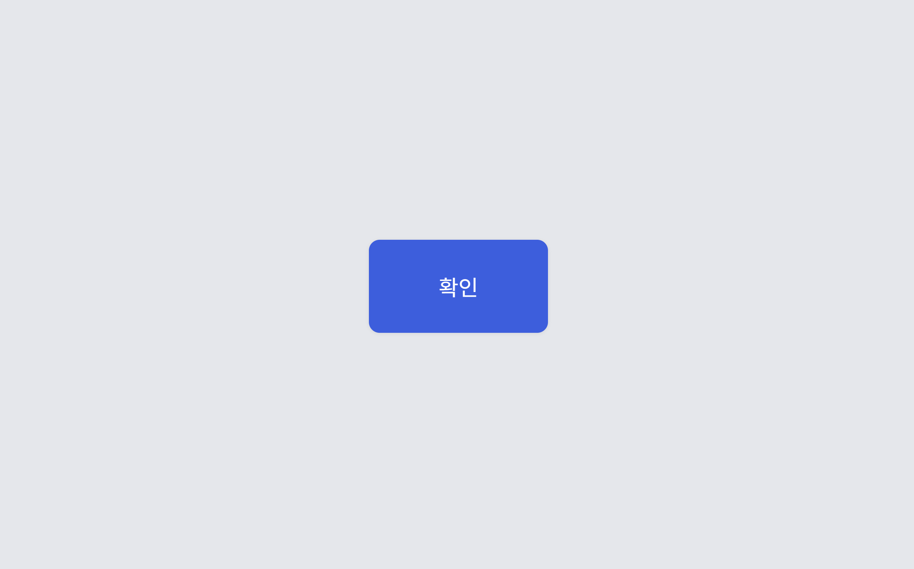
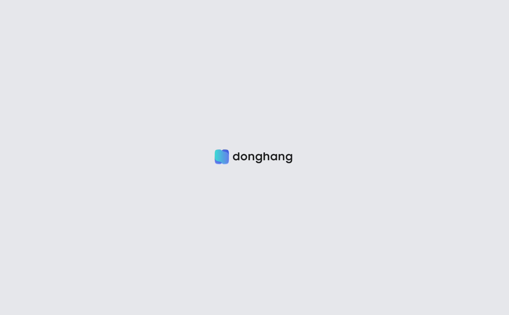

# ⚙️ 기능 설명

## 🏦 코어 뱅킹 구현

---

### 이체 플로우

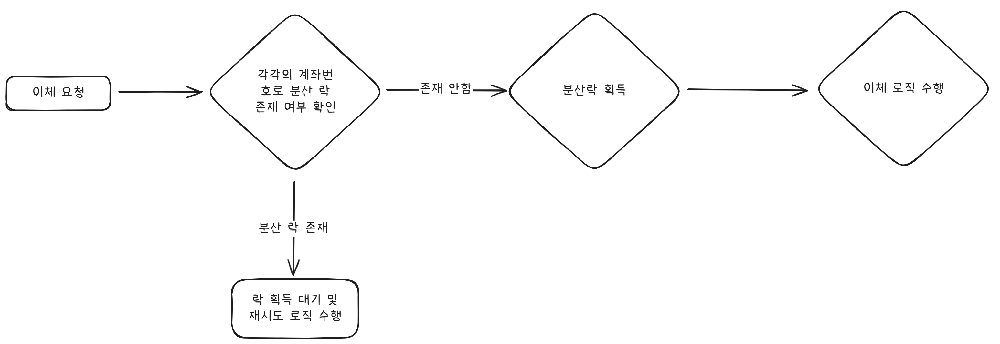

분산 환경에서 동일한 데이터에 대해 동시적인 접근을 막기 위해 글로벌 캐시로서 Redis의 Redisson을 통한 분산락을 활용했습니다. 구현의 편의성을 위해 AOP 형태로 구현하였으며, 원자성을 보장하기 위해 계좌번호의 크기별로 락을 생성해 데드락을 회피했습니다.

### 원장 검산 플로우

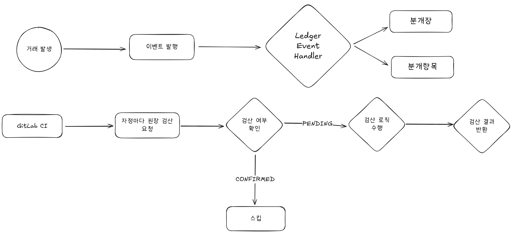

데이터의 정합성을 위해 자정 12시마다 GitLab CI를 통해 원장 검산 로직을 호출해 오류 항목과 하룻동안의 거래 현황을 파악합니다.

### 적금 납입일 자동 이체

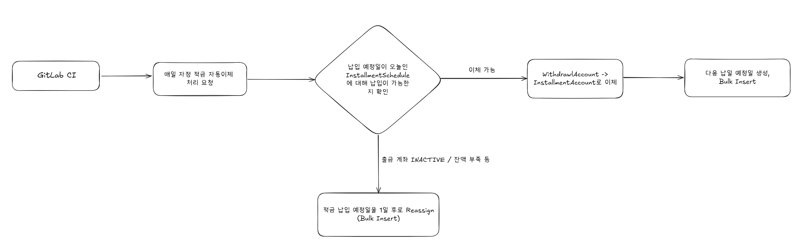

장애 대응을 위해 서버 이중화를 해놓았기 때문에, 스케줄러를 통해 처리할 경우 데이터 정합성에 오류가 생기게 됩니다.

GitLab CI에서 적금 납입 일괄 처리 API를 호출하여 하나의 서버에서 일괄 처리하도록 구현했습니다.

## 🎨 프론트엔드 컴포넌트 및 기능 구현

---

### 1. 3D AI 은행원 구현

- **Three.js** 를 사용한 3D 아바타 적재 및 **Blender** 을 통한 애니메이션 구현했습니다.
- 아바타의 동작 처리를 간편화 하여 **오디오 대사, 자막, 애니메이션, 이후 행동**을 **하나로 묶어 간편하게 실행**할 수 있도록 했습니다.
- Electron 에서 기존 Web Speech API 를 사용하는데 제약이 생겨 **VAD 시스템**을 직접 구현했습니다. 사용자의 평균 음성 크기, 음성과 음성 사이의 공백 시간 등을 고려하여 개발했습니다.

### 2. Electron 듀얼 모니터 구현

- **듀얼 모니터** 사용으로 인해 메인 모니터와 서브 모니터를 나뉘어 창을 구현하였습니다.
- 메인 모니터에는 전체적인 **은행 업무 기능**들을 주로 이루어져 있습니다.
- 서브 모니터에는 **숫자 키패드** 입력 및 **주의 사항 안내 팝업**으로 이루어져 있습니다.
- **main, preload, renderer** 구조로 나누어 **ipcRenderer**를 활용하여 프로세서 통신을 구현하였습니다.

### 3. 시뮬레이터 구현

- **현금, 카드, 신분증** **투입구** 시뮬레이터를 UI로 구현하여 가상으로 시뮬레이션을 하였습니다.

### 4. 공통 컴포넌트 구현

- **숫자 키패드** 및 **각 숫자**를 공통 컴포넌트로 구현하였습니다.
- 각 도메인 별 **금융 방지**, **카드 투입**, **카드 인증**, **현금 투입**, **옵션 선택**, **숫자 입력 패널** 공통 컴포넌트를 구현하였습니다.
- 각 도메인 별 페이지 컴포넌트를 공통 컴포넌트로 적극 활용하여 구현하였습니다.

## 🧠 AI 기능 구현

---

### 1. 사용자 연령대 인식

- **OpenCV**의 **Haar Cascade Classifier** 을 통해 정면 얼굴일 경우 사람이 존재한다고 판단
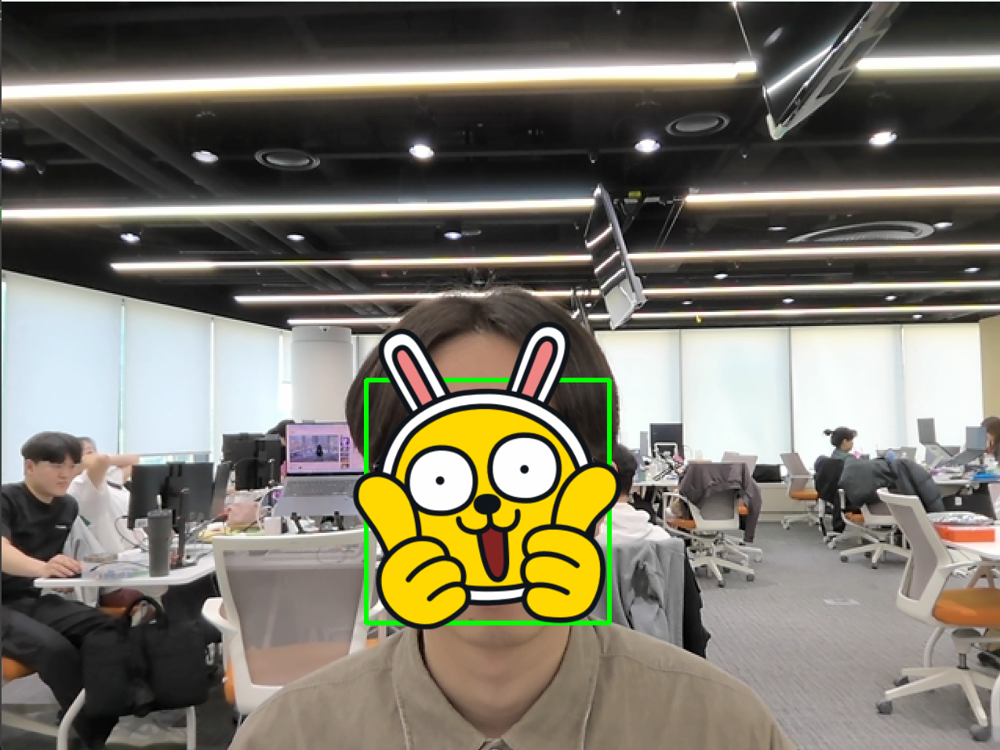 

- **Vision Transformer** 중 **ViTForImageClassification** 모델 활용하여 사람 얼굴에 따른 연령대 파악
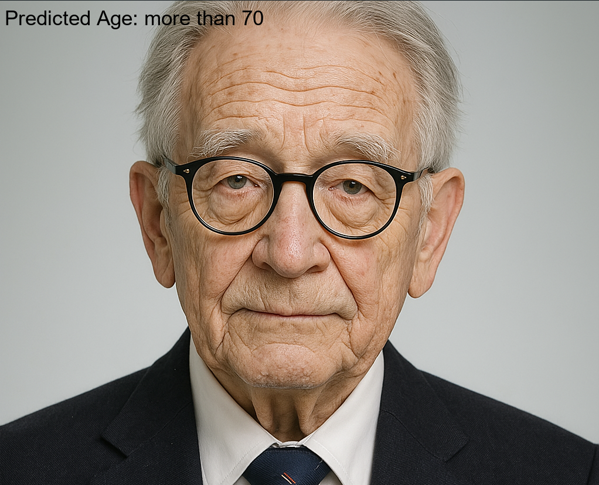

### 2. 행동 예측

- 클라이언트에서 음성을 인식하여 파일로 요청을 보냄 이를 **faster-whisper** 라이브러리를 사용하여 음성을 텍스트로 변환
- 사용자 행동과 예상 결과에 대한 데이터를 생성하고 이를 **FAISS 벡터DB**에 **Huggingface**에서 한국어 임베딩 모델 중 성능이 가장 높은 **intfloat/multilingual-e5-large-instruct** 모델을 활용해서 데이터 임베딩하여 저장
- **FAISS 벡터 검색**을 통해, 텍스트와 가장 유사한 행동을 찾아 예측
- 만약 유사도 점수가 낮으면 `"etc"`를 반환하여 예측된 행동이 없음을 표시

### 3. 보이스피싱

- Yolov11을 사용하여 통화하고 있는 사진 3000장을 학습하여 모델 생성
- 모델을 통해 통화하는 모습 탐지
- **FAISS 벡터 검색**을 통해, 사용자의 음성에서 보이스피싱 탐지
- 객체 탐지와 음성 인식에서 둘 다 검출되면 보이스피싱으로 판별
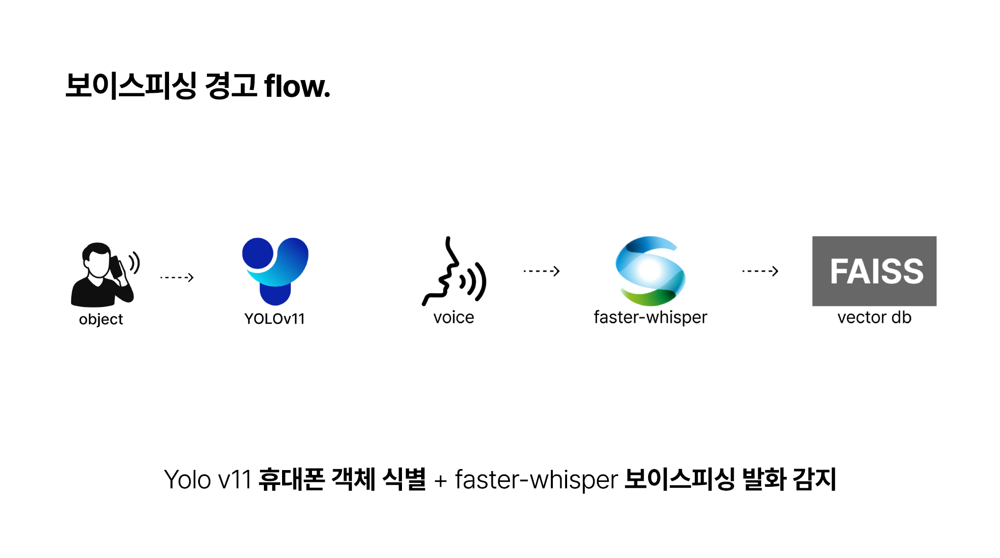

### 4. 계좌 추천

- STT을 통해 사용자의 음성을 텍스트로 변환
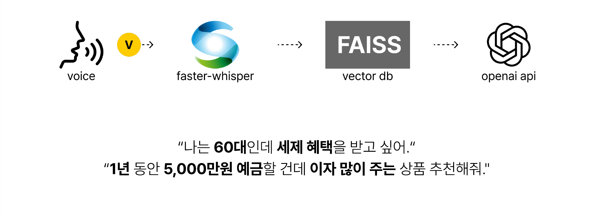 

---
- FAISS에서 사용자의 요구에 대한 유사도 검색을 통와 추천 이유를 제공
  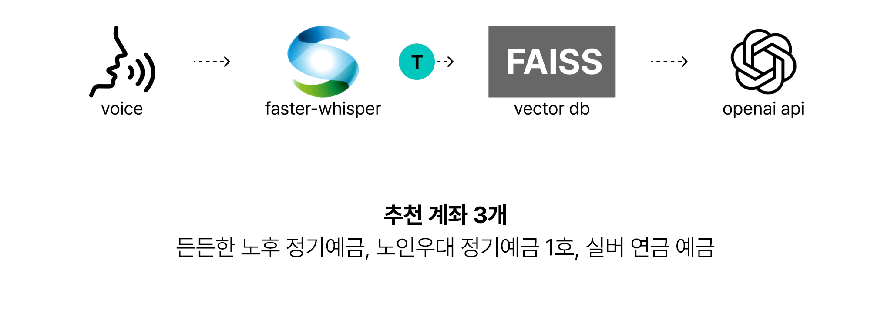

---
- OpenAI API를 활용하여 3개의 리스트 중 사용자 목적에 알맞은 계좌와 추천 이유를 제공
  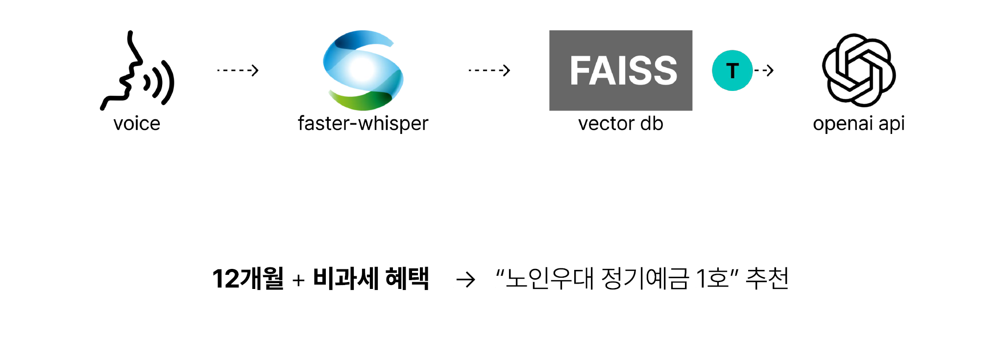

# 🧱 인프라 구성

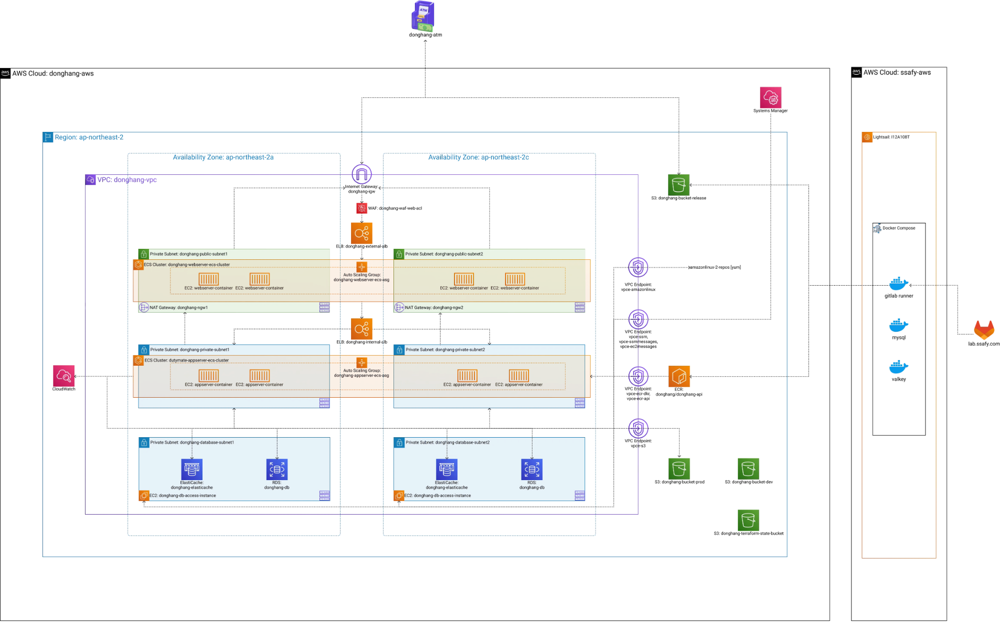

1. CI/CD 파이프라인을 통해 반복적인 작업을 자동화하여 예상치 못하게 발생할 수 있는 인적 오류를 방지했습니다.
2. Terraform을 사용해 인프라 상태를 코드로 관리했습니다.
3. 3-tier 아키텍쳐와 보안 그룹을 구성해 계층 간 격리를 강화하고, WAF 및 NAT Gateway를 통해 트래픽을 안전하게 처리했습니다.
4. 다중 AZ 구성과 이중화를 통해 가용성을 확보했습니다.
5. ECS 클러스터와 오토스케일링 그룹을 사용하여 애플리케이션의 확장성을 제공합니다.
6. LitmusChaos를 활용한 시스템 복원력 평가를 수행했습니다.

# 🛠️ 기술 스택

## Frontend  

## Backend  

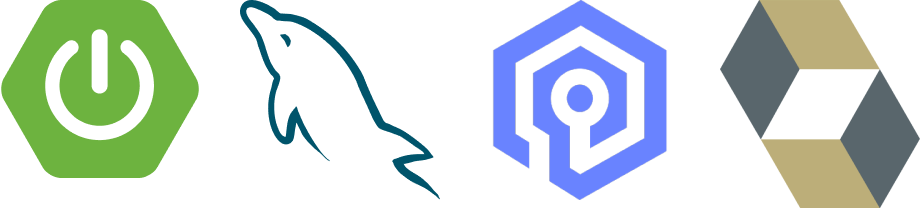

## Infra

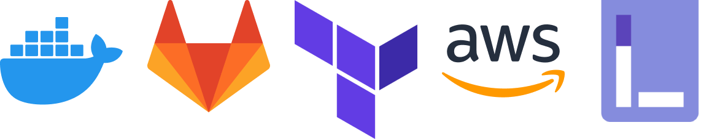

## AI  

# 🗺️ 와이어프레임

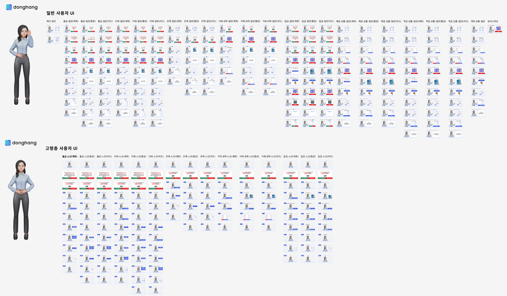

# 📊 ERD

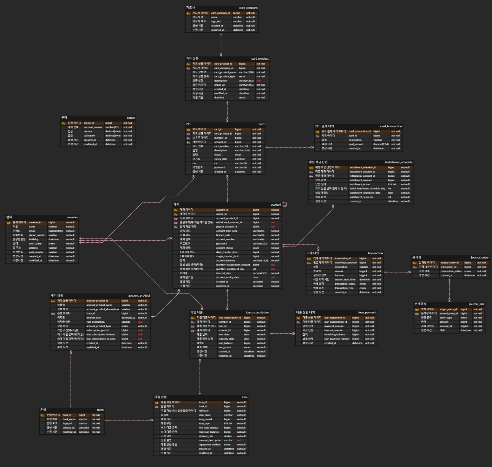

# 👥 팀원 소개

|  |  |  |  |  |  |
| --- | --- | --- | --- | --- | --- |
| 이주현 (팀장) | 박종하 | 이재백 | 최준혁 | 조강민 | 한종우 |
| Backend | Backend | Frontend | Frontend | AI | Infra |
| [column-wise](https://github.com/column-wise) | [freeftr](https://github.com/freeftr) | [beak1sin](https://github.com/beak1sin) | [raonrabbit](https://github.com/raonrabbit) | [KMsLOG](https://github.com/KMsLOG) | [jongwooo](https://github.com/jongwooo) |
